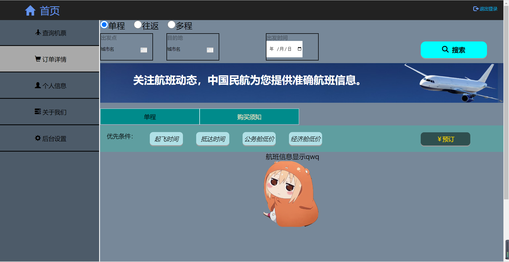
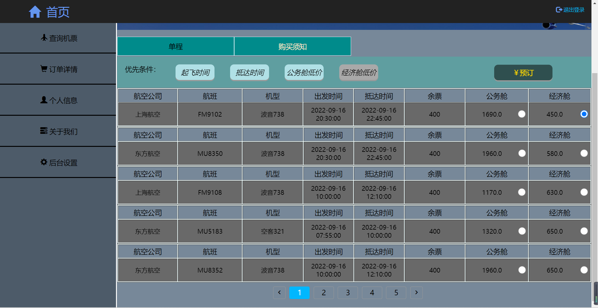

# 民航行程推荐
网址：www.planeinfo.top


#### 介绍
2022界软件杯A1赛题
项目部署在华为云服务器，网址如上 <br>
服务器使用操作系统-Linux Ubuntu 20 <br>


#### 软件架构 <br>
软件架构说明 <br>
1、开发语言：Python，解释器版本3.8.10； <br>
2、web后端使用Flask框架编写； <br>
3、B/S前后端分离； <br>
4、使用openpyxl与requests模块爬取携程网机票数据并存储Excel表格； <br>
5、机票信息最终以二进制形式存储； <br>
6、使用pandas库对机票信息（二进制）进行增删改查； <br>
7、使用Python高级API进程池、线程池实现高并发，加快机票筛查速度。 <br>


#### 安装教程

1.  部署项目到服务器 <br>

推荐放到家目录,打开服务器时用当前用户的权限，而不是直接root。
```
cd /home/xxx
```

```
git clone https://gitee.com/April_Zhao/web.git
```


2.  配置Python环境(root) <br>
更新pip `python3 -m pip install --upgrade pip` <br>
安装项目相关模块 `pip install -r requirements.txt` <br>


3.  配置nginx反向代理 <br>
安装nginx `apt install nginx` <br>
更改配置文件 <br>

```
rm /etc/nginx/sites-enabled/default
```

```
cp ./flask /etc/nginx/sites-enabled/flask
```
开放端口22/80/443/465
发送邮件时使用了smtp协议，因此请务必开放465端口

```
ufw allow 32
ufw allow 80
ufw allow 443
ufw allow 465
ufw enable
ufw status
```
检测nginx配置文件是否正确编写

```
nginx -t
```
若出现“ok”，“successful”字样则说明配置文件没有错误 <br>
如果一切正常，请务必重启Nginx让配置文件生效 <br>

```
service nginx restart
```

4、打开服务器 <br>
安装uwsgi独立容器

```
pip install uwsgi
```

在项目当前目录下打开uwsgi

```
uwsgi --ini wsgi.ini
```
注意1：最好不要用root打开容器，权限太高会有安全隐患，最好使用用户自己的权限，如`su zhao`即可。

注意2：项目中有若干隐藏文件，为外置环境变量的存放地，可以使用`ls -l`的命令查看，不影响使用。
<br>

5、关闭服务器

```
pkill -f wsgi -9
```
查看wsgi相关进程

```
ps aux | grep wsgi
```


#### 使用说明

1.  复制网址并在浏览器打开，会进入到登录页面

如果账号已注册则可以直接登录，输入邮箱后等待民航推荐网站发送邮件到你的邮箱，然后将邮件里的六位密码写入“验证码”处即可。 <br>
如果账号未注册，则可以点击"前往注册"进行账号注册;若账号已经注册则不能重复注册，会有提醒；若未注册则同登录操作;注册完成后可以进行登录操作。<br>

2.  进入主页面

如图所示，就是航班行程推荐的主页面。点击退出登录可以退出登录，左侧仅有查询机票按钮有效，其余按钮则只是装饰。

3.  机票搜索
如上图所示，可以点击“单程”、“往返”、“多程”中的任意一个进行机票搜索，其中，默认选择了“单程”。
①单程
需要选择出发城市、到达城市和出发时间，点击搜索进行搜索。

如图所示：机票信息在后端搜索若干秒后返回信息。有“起飞时间”、“抵达时间”、“公务舱低价”、“经济舱低价”四个选项，用户可以选择适合自己的机票，以”经济舱低价“为例，选择之后点击预定即可。

点击预定之后进入支付页面。

在支付页面，用户可以通过输入邮件来实现多用户购买同程的机票，为了方便起见，添加的乘客信息不需要注册。
若对选择的机票与价格没有异议，则可以点击支付，在弹出”支付成功“后，用户则会收到一封邮件。


<br>
####实现原理和技术细节


#### 参与贡献

1.  Fork 本仓库
2.  新建 Feat_xxx 分支
3.  提交代码
4.  新建 Pull Request


